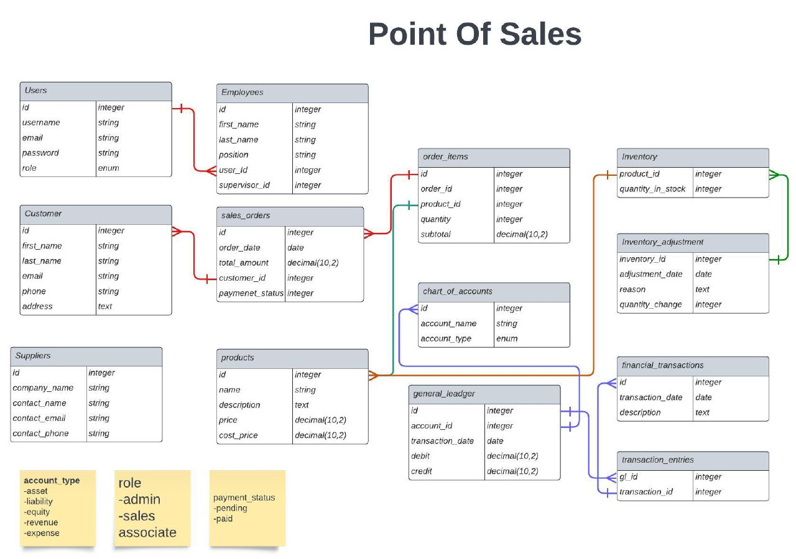

# Point of Sale (POS) Application



## Overview

This Point of Sale (POS) application is designed to streamline sales, manage inventory, and simplify business operations for retail businesses. It provides an intuitive user interface for handling various aspects of your business, including sales management, product inventory, customer data, and employee roles and permissions.

## Contributors

Currently this project is initiated by [me](https://www.instagram.com/thesaktibuana/) and contributed by fellow [Arip Budiman](https://www.instagram.com/aripbudiman22/), give us DM if you wanted to contribute also.


## Features

- **Sales Management**: Create, process, and track sales orders, including the ability to add products, apply discounts, and print receipts or invoices.

- **Inventory Control**: Manage product listings, organize products into categories, and track stock levels. Receive new stock and manage supplier information.

- **Customer Management**: Keep track of customer data, organize customers into groups, and implement customer loyalty programs.

- **Employee Management**: Manage employee records, roles, and permissions to control access to various parts of the application.

- **Reporting and Analytics**: Generate sales reports, inventory status reports, and financial statements to gain insights into your business.

- **Settings and Customization**: Customize application settings, payment methods, receipt/invoice templates, and user management.

## Installation and Setup

1. **Clone the Repository**:
git clone https://github.com/yourusername/pos-application.git


2. **Install Dependencies**:

cd pos-application
composer install
npm install && npm run dev


3. **Database Setup**:
- Create a MySQL database and configure the `.env` file with your database credentials.
- Run database migrations:
  ```
  php artisan migrate
  ```

4. **Start the Application**:
- Start the Application:
  ```
  php artisan serve
  ```

5. **Access the Application**:
Open your web browser and navigate to `http://localhost:8000` to access the application.

6. **Login Credentials**:
- Admin:
  - Username: admin@example.com
  - Password: adminpassword
- Employee:
  - Username: employee@example.com
  - Password: employeepassword

## Screenshots


## Contributing

Contributions are welcome! Please follow our [contribution guidelines](CONTRIBUTING.md).

## License

This project is licensed under the [MIT License](LICENSE).

---

**Note:**
There are no note aside to always mention me in every of your slides/work presentation